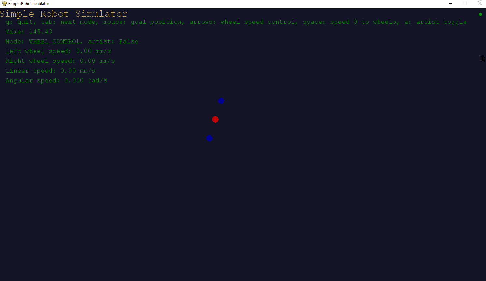

[](https://github.com/ambv/black)

## Purpose
A simple simulator to explore direct and inverse kinematics for a differential wheeled robot


 
## Install
Tested with Python 3.6 but should work as long as pygame is installed.
```
pip install pygame
```

## Usage 
``` 
python main.py
```
Keys:
```
q: quit
tab: next mode
mouse: goal position
arrows: wheel speed control
space: speed 0 to wheels
a: artist toggle
```